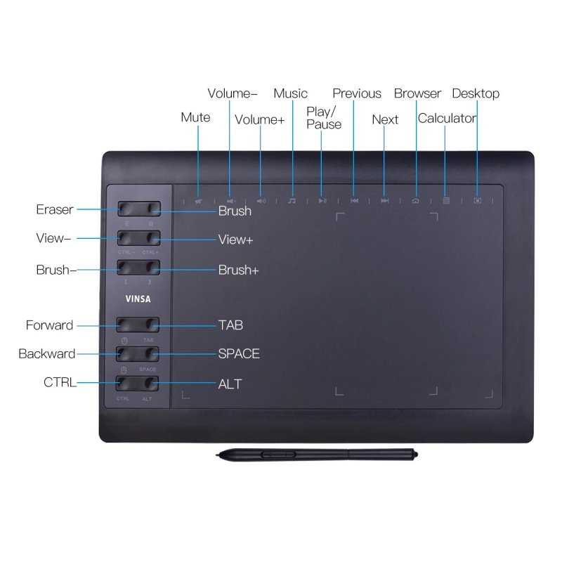

Vinsa 1060 plus - driver-all-in-one
=====================================
This is the all-in-one version from Delfosse Aurore([ON7AUR](https://www.qrz.com/db/ON7AUR))

Forked from [f-caro](https://github.com/f-caro/10moons-driver-vin1060plus) (Thanks for your work,I wanted to add upper buttons and include work from Alex to have «everything-in-one» executable)...
Forked from [Alex-S-V](https://github.com/alex-s-v/10moons-driver) ( thanks dude for the pyUSB and T503 case study) 



[10moons Graphics Tablet product homepage](http://eng.10moons.com/info5494.html)

[Aliexpress equivalent sold under VINSA brand. --- Download User Manual](http://blog.ping-it.cn/h/8/sms.pdf)

This is a Simple driver with pyUSB code modified to handle the interaction events of the VINSA 1060Plus graphics tablet, that includes a passive two button pen.

Linux detects it as a T501 GoTOP tablet,  hence pyUSB library is able to interface with the tablet device.

# About

Driver which provides basic functionality for VINSA 1060plus T501 tablet:
* 12 buttons on the tablet itself
* 10 buttons on top
* Correct X and Y positioning (two active area modes present:  Android Active Area & Full Tablet Active Area)
* Pressure sensitivity ( able to read the values, but unable to pass it onto Graphics Software )

Tablet has 4096 levels in both axes and 2047 levels of pressure ( Product description says 8092, but actual output readings are 2047 max).

## The progress so far...

With linux Kernel 5+,  the graphics tablet should be detected but pen movement is restricted to Android Active Area (the small area on the tablet).  That driver was added to the kernel but interacts with the T503 chipset. 
Thanks to [Digimend - https://github.com/DIGImend](https://github.com/DIGImend) for providing valuable functionality not just to 10moons Tablets, but to a variety of other popular Tablets.

Unfortuantely, Mr Digimend has chosen not to further develop the driver applicable to VINSA 1060plus, due to the inaccurate information transmitted between the T501 chipset and the USB driver --> [Live recording of Mr DIGIMEND working on 10moons tablet debug and analysis.  Awesome to see the master at work :)](https://www.youtube.com/watch?v=WmnSwjlpRBE).

The person to discover this "hack" was Mr.Digimend himself and thanks to the [Youtube video that he uploaded time-stamp @1:40.11](https://youtu.be/WmnSwjlpRBE?t=6011) he shows that usbhid-dump  output when in Android-Active-Area Mode (8 byte TX)  vs  the required  Full-Tablet-Active-Area mode ( 64 byte TX).


# How to install
1.  Clone this repository
```bash
git clone https://github.com/extenebrisadlucem/vinsa1060plus-driver-all-in-one.git
```
2.  Change Directory and create a virtual environment for python
```bash
cd vinsa1060plus-driver-all-in-one/
# As it's a driver, you must be administrator
sudo su
# create virtual environment to avoid polluting your system with (old)modules
python3 -m venv .venv
# get modules from the net
pip install -r requirements.txt
# If you feel confident with versions execute this :
# pip install evdev pyusb PyYAML nuitka 
```
From here, your driver is runable, but may be slow on some systems...
```bash
# if you want to give a try
python driver_vin1060plus.py
```
3.  Create a converted/compiled system level application
In order to increase speed, convert your python in C and build it as a system application.
(you can do it with your favorite applications like cython, pyinstaller,Pyoxidizer,nuitka …). I choosed **nuitka**, it's kind of slow to build your system executable, but it's all included.
```bash
nuitka --standalone --onefile --include-module=evdev --include-data-file=config-vin1060plus.yaml=./config-vin1060plus.yaml driver-vin1060plus.py
```
This command will build your executable, including the yaml inside as the default config file. Your custom config file will be in your ~/.config/config-vin1060plus/config-vin1060plus.yaml

4.  Execute it
You can choose to execute it only in python and avoid step 3, but in another case you'll have to do :
```bash
sudo su 
nohup ./driver-vin1060plus.bin &
exit
```


>  :clipboard: **You need to connect your tablet and run the driver prior to launching a drawing software otherwise the device will not be recognized by it.**


# Configuring tablet

Configuration of the driver placed in `~/.config/config-vin1060plus/config-vin1060plus.yaml` file.

You may need to change the *vendor_id* and the *product_id* but I'm not sure (You device can have the same values as mine, but if it is not you can run the *lsusb* command to find yours).

Buttons assigned from top left (button 1) to bottom right (button 12) in the order from left to right. You can assign to them any button on the keyboard and their combinations separating them with a plus (+) sign.

If you find that using this driver with your tablet results in reverse axis or directions (or both), you can modify parameters *swap_axis*, *swap_direction_x*, and *swap_direction_y* by changing false to true and another way around.

for example:  Rotating tablet in portrait position ( with buttons furthest from person )
    ```
    settings:
        swap_axis: true
        swap_direction_x: true
        swap_direction_y: false
    ```
Not a nice experience, feels weird --- but at least it is nice to know that you can do such a thing. (Thanks Alex-S-V for the ground work).

## Changing Button/Key shortcuts

`config-vin1060plus.yml` contains a Key code list ( variable `tablet_buttons` ) that allows the user to edit the 12 buttons found on the left-side of the graphics tablet.

To list all the possible Key codes you may run:
```
python -c "from evdev import ecodes; print([x for x in dir(ecodes) if 'KEY' in x])"
```
example output:
```
['EV_KEY', 'KEY', 'KEY_0', 'KEY_1', 'KEY_102ND', 'KEY_10CHANNELSDOWN', 'KEY_10CHANNELSUP', 'KEY_2', 'KEY_3', 'KEY_3D_MODE', 'KEY_4', 'KEY_5', 'KEY_6', 'KEY_7', 'KEY_8', 'KEY_9',...

```
`config-vin1060plus.yml` also contains a BTN code list ( variable `pen_buttons` ) that allows the user to edit the 2 buttons found on passive stylus pen.

To list all the possible Mouse/Stylus BTN codes you may run:
```
python -c "from evdev import ecodes; print([x for x in dir(ecodes) if 'BTN' in x])"
```
example output:
```
['BTN', 'BTN_0', 'BTN_1', 'BTN_2', 'BTN_3', 'BTN_4', 'BTN_5', 'BTN_6', 'BTN_7', 'BTN_8', 'BTN_9', 'BTN_A', 'BTN_B', 'BTN_BACK', 'BTN_BASE', 'BTN_BASE2',...
```

> Useful Doc explaining how the Kernel categorises and uses those ecodes : 
  https://www.kernel.org/doc/Documentation/input/event-codes.txt

> Input-Event-codes Src from Github : 
  https://github.com/torvalds/linux/blob/master/include/uapi/linux/input-event-codes.h


# Credits

> Some parts of code are taken from: 
  https://github.com/Mantaseus/Huion_Kamvas_Linux

> Other parts taken from:  
  https://github.com/alex-s-v/10moons-driver

> All inspiration tricks and tactics taken from : 
  https://github.com/DIGImend/10moons-tools

> Together with howto videos from DigiMend :  
  https://www.youtube.com/watch?v=WmnSwjlpRBE

> DigiMend conference talk on interfacing grahics tablets in Linux:  
  https://www.youtube.com/watch?v=Qi73_QFSlpo

The forum that got me started with finding a simple solution to my cheap graphics tablet purchase:  

> "Please Add support for 10moons 10*6 inch Graphics Tablet #182" 
  https://github.com/DIGImend/digimend-kernel-drivers/issues/182

# Known issues

* Pressure sensitivity is actually Z-axis height,  where digital 0 is approx 2mm below the graphical tablet surface and digital 8192 is approx 25mm above the graphical tablet. Useful "Pressure sensitivity" values show up in the range of digital 400 and digital 2048.  In `config-vin1060plus.yml` file,  the property  `pressure_contact_threshold` was chosen by trial and error.  Colder temperatures affect the "pressure sensitivity" range.

* `DEBUG = True` , [flag variable exists](https://github.com/f-caro/10moons-driver-vin1060plus/blob/a9cb0839de7a56f56fe0facc96c7e4c2cf0e86de/driver-vin1060plus.py#L12) that helps debug the typical behaviour surrounding the driver interaction with T501 graphics compatible tablet.  To be honest, it's just print() statements alllll theee waaayyyy downnnn. :)

* On stylus button sometimes keep sending «K» or «P», juste press «space» on tablette button.


# TODOS

* Key Combinations dont work as expected. Need to debug that.  Keyboard HotKeys also dont work as expected.  Maybe try a different keyboard/mouse interaction python library --- ( pynPut ) https://nitratine.net/blog/post/simulate-keypresses-in-python/

* Allow the Graphics App (e.g. Gimp, Scribus, Pix, Inkscape etc. ) to make use of the "pressure sensitivity" measurement. I think the issue lies with  `vpen.write(ecodes.EV_KEY, ecodes.BTN_TOUCH, 0)`  and  `ecodes.BTN_MOUSE` conflict.  `BTN_TOUCH` does not execute event, while  `BTN_MOUSE` does. ???

* Use its linear Z-axis "pressure sensitivity" measurements and map it to a non-linear function (maybe bezzier-curve) that simulates more natural pen strokes. :)

# Useful references

* Docs to Python source code of UInput class :  https://python-evdev.readthedocs.io/en/latest/_modules/evdev/uinput.html
* pyUSB tutorial howto : https://github.com/pyusb/pyusb/blob/master/docs/tutorial.rst
* wireshark tips on howto filter USB traffic ( [better to use the video from Digimend](https://www.youtube.com/watch?v=WmnSwjlpRBE) ) : https://osqa-ask.wireshark.org/questions/53919/how-can-i-precisely-specify-a-usb-device-to-capture-with-tshark/  :::   howto configure in Linux : https://wiki.wireshark.org/CaptureSetup/USB  :::  tutorial with step-by-step screenshots : https://github.com/liquidctl/liquidctl/blob/main/docs/developer/capturing-usb-traffic.md
* PDF USB.org  Device Class Definition for Human Interface Devices Firmware Specification : https://www.usb.org/sites/default/files/documents/hid1_11.pdf
* Digimend howto do diagnostics when trying out new tablets in Linux : http://digimend.github.io/support/howto/trbl/diagnostics/
* 10moons 10x6 tablet homepage : http://eng.10moons.com/info5494.html  :::  picture revealing possible circuit schematic ??  http://eng.10moons.com/info5494.html
* libUSB C library initialization/deinitialization : https://libusb.sourceforge.io/api-1.0/group__libusb__lib.html#details
* USB in a Nutshell - tutorial/howtos/references : https://www.beyondlogic.org/usbnutshell/usb1.shtml


